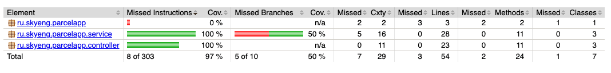

## Задание

Необходимо реализовать REST API, который позволяет отслеживать почтовые отправления.
В системе должны регистрировать почтовые отправления — письма, посылки — их передвижение между почтовыми отделениями, а также должна быть реализована возможность получения информации и всей истории передвижения конкретного почтового отправления.
Операции, которые должны быть реализованы:
- регистрации почтового отправления,
- его прибытие в промежуточное почтовое отделение,
- его убытие из почтового отделения,
- его получение адресатом,
- просмотр статуса и полной истории движения почтового отправления.

Почтовое отправление определяется следующими свойствами:
- идентификатор,
- тип (письмо, посылка, бандероль, открытка),
- индекс получателя,
- адрес получателя,
- имя получателя.

Почтовое отделение характеризуется следующими свойствами :
- индекс,
- название,
- адрес получателя.

Сервис может быть реализован в видео JSON либо XML-сервиса на выбор. Сервис может быть реализован при помощи стека Java EE или Spring.

СУБД для хранения данных может использоваться любая.

Работа с данными должна быть выполнена с помощью ORM, библиотека может использоваться любая.

Приложение должно быть собрано при помощи Maven или Gradle.

Результатом работы должен быть war или ear-архив, который может быть размещен на сервер приложений. Для отладки и демонстрации может использоваться любой сервер приложений.

К приложению должно прилагаться описание его API — структура запросов и ответов, список допустимых операций, можно это реализовать в виде проекта SoapUI.

Код должен быть покрыт тестами минимум на 70% (приложить скрин покрытия)


## API


Parcels
- `GET`     /parcels/{id} - получение посылки по id
- `POST`    /parcels - создание посылки

Post Office:
- `GET`     /post-offices/{id} - получение почтового отделения по id
- `POST`    /post-offices - создание почтового отделения

Tracking
- `GET`     /trackings/{id} - получение трэкинга по id
- `POST`    /trackings - создание трэкинга
- `PUT`    /trackings/{id} - обновление трэкинга
- `GET`    /trackings?parcelId= - получение истории трэкинга по номеру посылки

`Tracking_API.postman_collection.json` - Postman коллекция для API запросов к серверу.

Вышеуказанные API позволяет выполнять операции из задания.

- регистрации почтового отправления -> `POST /parcels`
- его прибытие в промежуточное почтовое отделение -> `POST /trackings`
- его убытие из почтового отделения -> `PUT /trackings/{id}`
- его получение адресатом -> `PUT /trackings/{id}`
- просмотр статуса и полной истории движения почтового отправления -> `GET /trackings?parcelId=`

## База данных

Используется `H2 InMemory DB` для простоты запуска и тестирования.


### Тесты

Код покрыт юнит тестами. 


### Инструкция

Собрать проект
```
./gradlew bootJar 
```

В папке `builds/libs` сгенерируются архив `.jar`


Собрать проект `.war`
```
./gradlew bootWar 
```

В папке `builds/libs` сгенерируется архив `.war`


Отчет по покрытию тестами. 
```
./gradlew jacocoTestReport
```
Из тест отчета исключены классы, которые имеют автогенерируемый код от MapStruct и Lombok.




Запустить сервис
```
./gradlew bootRun
```

Запустить тесты

``` 
 ./gradlew test
```


Запустить докер

`./gradlew bootJar` - собрать `.jar` архив.

```
docker build -t api .

docker run -p 9009:9009 api
```

##  API спецификация 

- Swagger UI: http://localhost:9009/swagger-ui/index.html

- Opem API: http://localhost:9009/v3/api-docs

## Ссылки

- https://bootify.io/spring-data/mapstruct-with-maven-and-lombok.html
